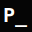

# PhilApps Garage 🛠️

A personal portfolio project themed around retro terminal aesthetics and "vibecoding" energy. This is where I document my tinkering, experiments, and the "it works on my machine" protocol.

## 🕹️ The Concept

PhilApps Garage is a tribute to the garage-disk-drive era, where logic meets instinct. It features:
- **Hero Terminal**: A live-scrolling terminal simulation with custom "vibecoding" logs and a functional hover prompt.
- **Tinkering Progress**: A minimalist "About" section focused on the *Try-Fail-Learn-Iterate* cycle.
- **Vibecoded Portfolio**: Showcasing projects like *Kanban Vibecoded* and *Journal Vibecoded*.

## 🎨 Visual Identity

The project uses a monochromatic DOS-inspired palette defined in `src/styles/global.css`:
- **Background**: `#050505` (Deep Black)
- **Primary**: `#00ff00` (Classic Terminal Green)
- **Favicon**: A minimalist `P_` logo representing the command line prompt on a terminal screen.


## 🚀 Tech Stack

- **Framework**: [Astro 5](https://astro.build/) (Static Site Generation)
- **Styling**: [Tailwind CSS 4](https://tailwindcss.com/) (using the new `@theme` configuration)
- **Fonts**: VT323 (Terminal), Fira Code (Sans), Silkscreen (Pixel), Oxanium (Titles)

## 📁 Structure

```text
/
├── public/                 # Static assets (favicons, portfolio images)
├── scripts/                # Utility scripts (generate-previews.cjs)
├── src/
│   ├── components/         # Modular Astro components (Hero, About, Portfolio)
│   ├── data/               # Project metadata (portfolio.json)
│   ├── pages/              # Main routing (index.astro)
│   └── styles/             # Global CSS & Tailwind V4 theme
└── astro.config.mjs
```

## 🧞 Commands

All commands are run from the root of the project:

| Command | Action |
| :--- | :--- |
| `npm install` | Installs dependencies |
| `npm run dev` | Starts local dev server at `localhost:4321` |
| `npm run build` | Builds the production site to `./dist/` |
| `npm run preview` | Previews the build locally |
| `npm run generate-previews` | Runs the script to generate portfolio preview images |

---
*System Ready. Welcome to the Garage.*