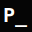

# PhilApps Garage 🛠️

> *A personal digital workshop — where curiosity meets the command line.*

A portfolio project built around retro terminal aesthetics and **vibecoding** energy. This is where I document my tinkering, experiments, and the *"it works on my machine"* protocol.

---

## 🕹️ The Concept

PhilApps Garage is a tribute to the garage-disk-drive era, where logic meets instinct.

| Section | Description |
| :--- | :--- |
| 🖥️ **Hero Terminal** | Live-scrolling terminal simulation with custom vibecoding logs |
| 🔧 **Tinkering Progress** | Minimalist About section focused on the *Try → Fail → Learn → Iterate* cycle |
| 📦 **Portfolio** | Vibecoded projects — Kanban, Journal, and more |
| ✈️ **Travel Slider** | Because everyone needs a destination |
| 👁️ **The Watcher** | Automated tech intelligence feed powered by 🦞 [OpenClaw](https://github.com/openclaw/openclaw) |

---

## 🎨 Visual Identity

DOS-inspired monochromatic palette defined in `src/styles/global.css`:

| Token | Value | Usage |
| :--- | :--- | :--- |
| `dos-bg` | `#050505` | Page background |
| `dos-green` | `#00ff00` | Terminal green accent |
| `win95-gray` | `#e0e0e0` | Body text |

**Fonts:** VT323 · Fira Code · Silkscreen · Oxanium

---

## 🚀 Tech Stack

- **Framework** — [Astro 5](https://astro.build/) (Static Site Generation)
- **Styling** — [Tailwind CSS 4](https://tailwindcss.com/) with `@theme` configuration
- **Intel feed** — 🦞 [OpenClaw](https://github.com/openclaw/openclaw) (AI-powered RSS crawler)

---

## 📁 Structure

```text
/
├── public/                 # Static assets (favicons, portfolio images)
├── scripts/                # Utility scripts (generate-previews.cjs)
├── src/
│   ├── components/         # Modular Astro components (Hero, About, Portfolio…)
│   ├── data/               # Project metadata (portfolio.json)
│   ├── pages/              # Routing — index.astro, watcher.astro
│   └── styles/             # Global CSS & Tailwind V4 theme
└── astro.config.mjs
```

---

## 🧞 Commands

| Command | Action |
| :--- | :--- |
| `npm install` | Install dependencies |
| `npm run dev` | Start local dev server at `localhost:4321` |
| `npm run build` | Build production site to `./dist/` |
| `npm run preview` | Preview the build locally |
| `npm run generate-previews` | Generate portfolio preview images |

---

*System Ready. Welcome to the Garage.*
